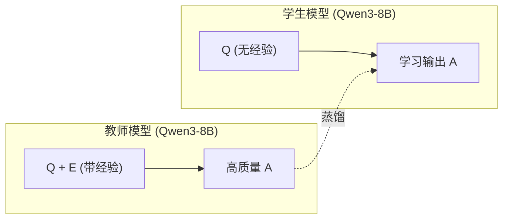

# LLM 知识蒸馏训练框架实现计划

## 核心思路



三种蒸馏方法对应不同的监督信号：

- **SeqKD**: 直接用教师的输出 A 作为硬标签做 SFT
- **SKD**: 用教师在 Q+E 上对 A 的 token 级概率分布作为软标签
- **On-Policy GKD**: 学生自己生成输出，教师对学生输出提供 token 级反馈

---

## 文件结构

```javascript
kd/
├── configs/
│   ├── base.yaml           # 基础配置（模型路径、通用参数）
│   ├── skd.yaml            # SKD 特定配置
│   ├── seqkd.yaml          # SeqKD 特定配置
│   └── gkd.yaml            # GKD 特定配置
├── src/
│   ├── data/
│   │   ├── __init__.py
│   │   └── dataset.py      # 数据加载与预处理
│   ├── trainers/
│   │   ├── __init__.py
│   │   ├── skd_trainer.py  # SKD 训练器
│   │   └── seqkd_trainer.py # SeqKD 训练器（基于SFT）
│   └── utils/
│       ├── __init__.py
│       └── config.py       # 配置加载工具
├── train_skd.py            # SKD 训练入口
├── train_seqkd.py          # SeqKD 训练入口
├── train_gkd.py            # GKD 训练入口（使用 TRL）
└── train_data/             # 已有数据
```

---

## 实现要点

### 1. SeqKD (最简单)

在无经验输入上对教师输出做 SFT，使用 TRL 的 `SFTTrainer`：

- 输入：noexp 的 system prompt + user message
- 标签：有经验数据集的 assistant response
- 本质是标准 SFT

### 2. SKD (监督式蒸馏)

需要自定义 Trainer 实现 token 级 KL 散度损失：

- 教师模型加载有经验的输入 (Q+E)，计算其在目标序列 A 上的 logits
- 学生模型加载无经验的输入 (Q)，学习模仿教师的概率分布
- 损失函数：前向 KL 散度 `KL(p_T || p_S)`

### 3. On-Policy GKD

直接使用 TRL 的 `GKDTrainer`：

- 学生模型在无经验输入上自采样生成输出
- 教师模型对学生输出提供 token 级概率分布反馈
- 可配置 `lmbda`（on-policy 比例）和 `beta`（JSD 插值系数）

---

## 关键配置项

```yaml
# base.yaml
model:
  student_path: "Qwen/Qwen3-8B"
  teacher_path: "Qwen/Qwen3-8B"  # 同一模型，不同输入
  enable_thinking: false          # non-thinking 模式
  torch_dtype: bfloat16

training:
  per_device_train_batch_size: 2
  gradient_accumulation_steps: 8
  learning_rate: 2e-5
  num_train_epochs: 3
  warmup_ratio: 0.1
  bf16: true
  
# gkd.yaml (继承 base.yaml)
gkd:
  lmbda: 0.5        # on-policy 比例
  beta: 0.5         # JSD 插值
  temperature: 0.9
  max_new_tokens: 256
```

---

## 多卡训练支持

使用 DeepSpeed ZeRO-3 或 FSDP 进行 8 卡分布式训练：

- 提供 `deepspeed_config.json` 配置
- 启动命令：`accelerate launch --config_file accelerate_config.yaml train_xxx.py`

---

## Qwen3 non-thinking 模式

根据 [qwen3-8b-modelcard.md](qwen3-8b-modelcard.md)，训练时需要：

- `tokenizer.apply_chat_template(..., enable_thinking=False)`